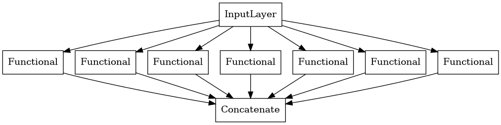
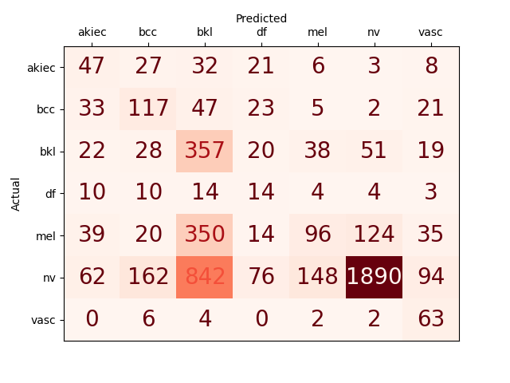

# ISIC 2018, 3ª tarefa

Em 2018, a *International Skin Imaging Collaboration* levantou o desafio *Skin Lesion Analysis Towards Melanoma Detection*, com o objetivo de incentivar o desenvolvimento de ferramentas de análise de imagem para permitir o diagnóstico automatizado de melanomas a partir de imagens dermoscópicas.

** Esse projeto é focado na terceira tarefa deste desafio ** , o de classificação de condições de pele, utilizando a base dados adquiridas em [no Kaggle/Skin-cancer-mnist-ham10000](https://www.kaggle.com/kmader/skin-cancer-mnist-ham10000) , e utilizará uma série de redes convolucionais embutidas com o propósito de classificar cada uma das imagens do teste em um dos 7 tipos possíveis.

## Metodologia
Os dados adquiridos primeiramente são separados em 2 pastas distintas, uma pasta contendo as 5000 amostras de treinamento separadas em sub pastas individuais para cada uma de suas classificações, e 5015 amostras de teste também separadas em sub pastas de acordo com sua classificação

Em seguida, foi implementado uma arquitetura de classificação composta pelos resultados de 7 redes convolucionais embutidas, cada uma responsável pela classificação binária de sua respectiva classe, e com entrada de tamanho 224wx224h RGB. A saida dessa rede de classificação se trata do resultado concatenado da sigmoidal final das redes embutidas, de acordo com o seguinte diagrama:

O conjunto de treinamento foi novamente dividido em um conjunto original para treinamento, e um para validação, definido como 20% das amostras de treinamento, tendo batches de tamanho 2 como entrada de treinamento e validação.
Essas redes foram treinadas com taxa de aprendizado 1-e06 com resultados *One-hot encoded* de classificação até que não houvesse redução de *loss* entre até 8 epoches, porém, apenas o modelo que obteve maior precisão na validação foi salvo e testado.  

## Resultados

O resultado das classificações do conjunto de teste pelo modelo treinado foi obtido pela função implementada em sklearn, e pode ser vista na matriz de confusão a seguir

Como pode ser observado, os resultados possuem um viés em direção a "nv" (*Melanocytic nevi*), demonstrando que o balanceamento atual de classes é insuficiente para lidar com a diferença das quantidades de amostras (60% para "nv")

## No futuro

Para melhores resultados e otimizações, esse projeto possivelmente será atualizado com novas tentativas de arquiteturas de modelos diferentes, assim como metodologias diferentes de aplicação. Em especial, menciona-se a possibilidade de balancear a presença de classes do conjunto de treinamento, ou de melhores definições de augmentação das imagens.